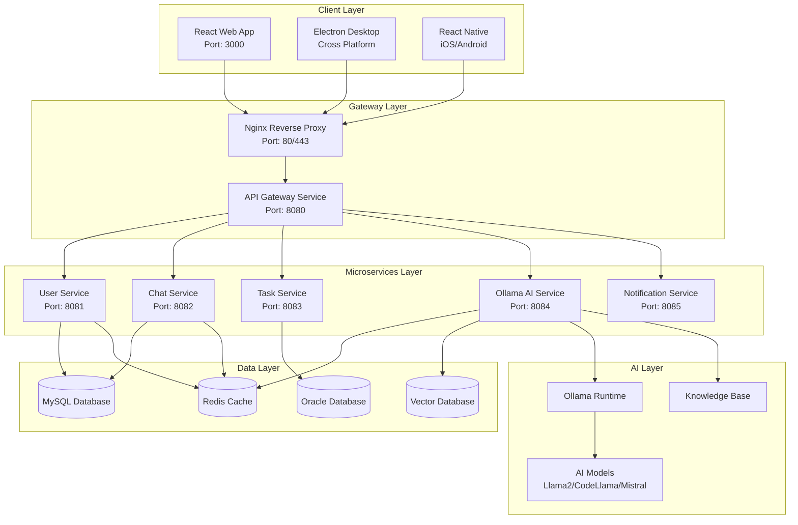
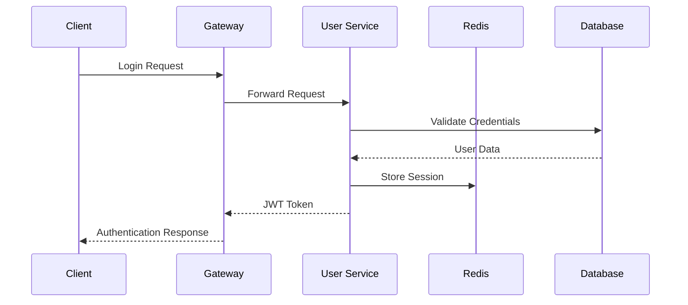
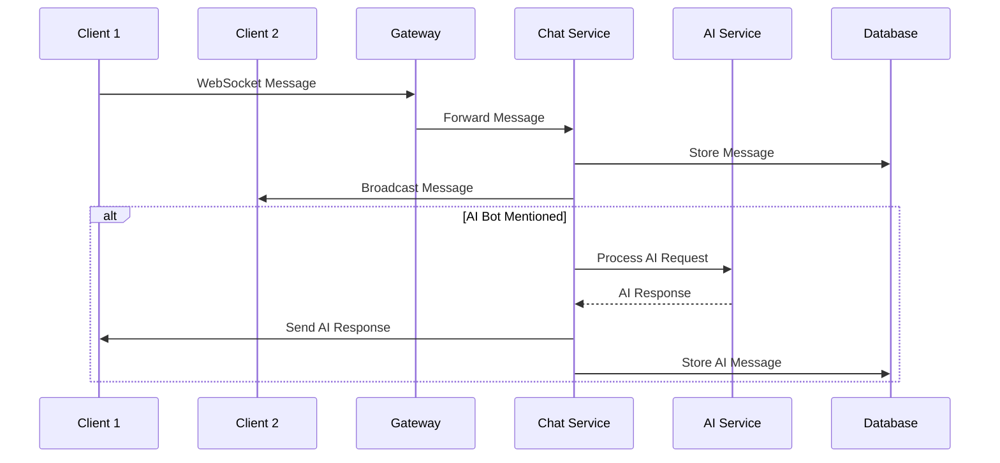
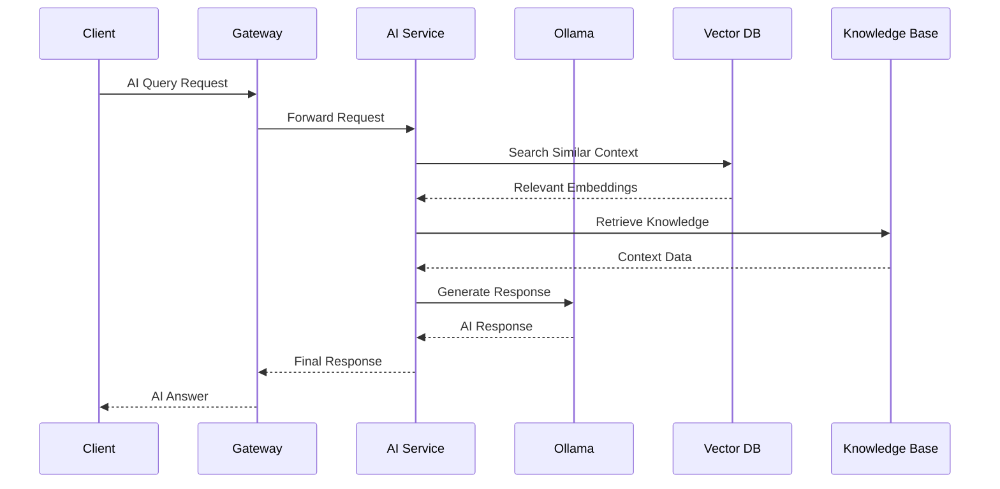

# 🏗️ AI Chat & Collaboration Solution Architecture Document

## 📋 Overview
This document provides a detailed description of the overall architecture for an AI chat and collaboration platform based on Vert.x MSA.

---

## 🎯 Architecture Principles

### 1. Microservices Architecture (MSA)
- **Single Responsibility Principle**: Each service is responsible for only one business domain
- **Independent Deployment**: Independent development, testing, and deployment per service
- **Technology Diversity**: Ability to choose optimal technology stack per service
- **Fault Isolation**: Minimize impact of one service failure on the entire system

### 2. Event-Driven Architecture (EDA)
- **Asynchronous Communication**: Loose coupling between services
- **Event Sourcing**: Recording state changes as events
- **CQRS Pattern**: Separation of commands and queries
- **Event Bus**: Internal communication using Vert.x Event Bus

### 3. Clean Architecture
- **Dependency Inversion**: High-level modules do not depend on low-level modules
- **Layer Separation**: Separation of Presentation, Business, and Data layers
- **Testability**: Independent testing capability for each layer

---

## 🏛️ System Architecture

### Overall System Configuration


### Detailed Architecture by Service

#### 1. API Gateway Service
```
┌─────────────────────────────────────┐
│           API Gateway               │
├─────────────────────────────────────┤
│ • Request routing & load balancing  │
│ • JWT token validation & auth       │
│ • Rate Limiting & Throttling        │
│ • CORS handling                     │
│ • Request/Response logging          │
│ • Circuit Breaker pattern          │
└─────────────────────────────────────┘
```

#### 2. User Service
```
┌─────────────────────────────────────┐
│           User Service              │
├─────────────────────────────────────┤
│ Presentation Layer                  │
│ • REST API Controllers             │
│ • WebSocket Handlers               │
├─────────────────────────────────────┤
│ Business Layer                      │
│ • User Management Logic            │
│ • Authentication Service           │
│ • Authorization Service            │
├─────────────────────────────────────┤
│ Data Layer                          │
│ • User Repository                  │
│ • Session Repository               │
│ • Cache Service                    │
└─────────────────────────────────────┘
```

#### 3. Chat Service
```
┌─────────────────────────────────────┐
│           Chat Service              │
├─────────────────────────────────────┤
│ Presentation Layer                  │
│ • WebSocket Handlers               │
│ • REST API Controllers             │
├─────────────────────────────────────┤
│ Business Layer                      │
│ • Real-time Messaging              │
│ • Message Broadcasting             │
│ • AI Bot Integration               │
├─────────────────────────────────────┤
│ Data Layer                          │
│ • Message Repository               │
│ • Room Repository                  │
│ • File Storage Service             │
└─────────────────────────────────────┘
```

#### 4. Ollama AI Service
```
┌─────────────────────────────────────┐
│         Ollama AI Service           │
├─────────────────────────────────────┤
│ Presentation Layer                  │
│ • AI API Controllers               │
│ • Model Management API             │
├─────────────────────────────────────┤
│ Business Layer                      │
│ • Model Inference Engine          │
│ • RAG Processing                   │
│ • Knowledge Base Manager           │
├─────────────────────────────────────┤
│ Data Layer                          │
│ • Vector Store                     │
│ • Model Repository                 │
│ • Embedding Service                │
└─────────────────────────────────────┘
```

---

## 🔄 Data Flow

### 1. User Authentication Flow


### 2. Real-time Chat Flow


### 3. AI Inference Flow


---

## 🔐 Security Architecture

### 1. Authentication & Authorization Management
- **JWT-based Authentication**: Stateless token-based authentication
- **Refresh Token**: Balance between security and usability
- **Role-based Access Control**: Role-based access control
- **API Key Management**: Inter-service communication security

### 2. Data Security
- **Encryption**: AES-256 encryption for sensitive data
- **HTTPS/TLS**: Data encryption in transit
- **Database Encryption**: Data encryption at rest
- **Input Validation**: Validation of all input data

### 3. Network Security
- **Private Network**: Internal network communication between services
- **Firewall Rules**: Port-based access control
- **VPN Access**: Administrator access restriction
- **DDoS Protection**: Rate limiting and traffic control

---

## 📊 Performance and Scalability

### 1. Caching Strategy
```
┌─────────────────────────────────────────────────────────┐
│                  Cache Layer Structure                  │
├─────────────────────────────────────────────────────────┤
│ L1: Application Cache (In-Memory)                       │
│ • Frequently used configuration values                  │
│ • Session data                                          │
├─────────────────────────────────────────────────────────┤
│ L2: Redis Cluster Cache                                 │
│ • User sessions                                         │
│ • Chat message cache                                    │
│ • API response cache                                    │
├─────────────────────────────────────────────────────────┤
│ L3: Database Query Cache                                │
│ • Query result cache                                    │
│ • Index cache                                           │
└─────────────────────────────────────────────────────────┘
```

### 2. Load Balancing
- **Nginx Load Balancer**: Traffic distribution and health checks
- **Service Discovery**: Dynamic service registration and discovery
- **Circuit Breaker**: Fault service isolation
- **Retry Policy**: Handling transient errors

### 3. Scalability Design
- **Horizontal Scaling**: Service instance scaling
- **Database Sharding**: Horizontal database partitioning
- **Microservice Decomposition**: Service granularization
- **Event-driven Architecture**: Performance improvement through asynchronous processing

---

## 🔧 Technical Decisions

### 1. Why Vert.x Was Chosen
- **High Performance**: Netty-based asynchronous processing
- **Reactive Programming**: Non-blocking IO
- **Event Bus**: Communication between microservices
- **Polyglot Support**: Support for various languages

### 2. Database Selection
- **MySQL**: Primary database, ACID compliance
- **Oracle**: Enterprise data (optional)
- **Redis**: Cache and session store
- **Vector DB**: AI embedding storage

### 3. AI Integration
- **Ollama**: On-premises AI model serving
- **Local GPU**: NVIDIA CUDA support
- **Model Optimization**: Quantization and compression
- **RAG System**: Knowledge base integration

---

## 📈 Monitoring and Logging

### 1. Application Monitoring
- **Prometheus**: Metrics collection
- **Grafana**: Visualization dashboard
- **Jaeger**: Distributed tracing
- **Health Check**: Service status monitoring

### 2. Log Management
- **Structured Logging**: JSON format logs
- **Centralized Logging**: ELK Stack (optional)
- **Log Level Management**: Environment-specific log levels
- **Log Rotation**: Disk space management

### 3. Alert System
- **Threshold-based Alerts**: CPU, Memory, Disk usage
- **Error Rate Monitoring**: Service-specific error tracking
- **SLA Monitoring**: Response time and availability
- **Business Metrics**: User activity indicators

---

## 🚀 Deployment Strategy

### 1. Container-based Deployment
- **Docker**: Application containerization
- **Docker-compose**: Local development environment
- **Kubernetes**: Production orchestration (optional)

### 2. CI/CD Pipeline
- **Source Code Management**: Git Flow strategy
- **Automated Build**: Maven/Gradle build
- **Automated Testing**: Unit, Integration, E2E testing
- **Zero-downtime Deployment**: Blue-Green or Rolling Update

### 3. Environment Management
- **Development**: Developer local environment
- **Staging**: Integration testing environment
- **Production**: Production environment
- **Configuration Management**: Environment-specific configuration separation

 